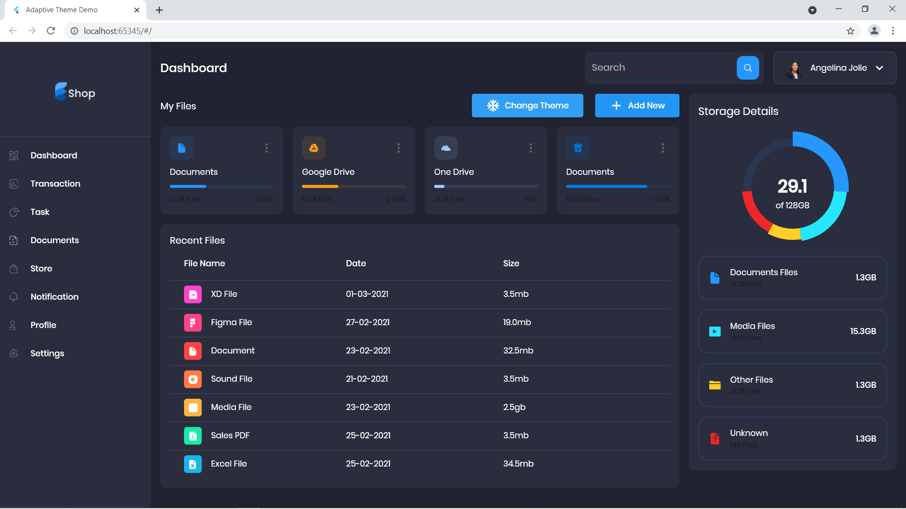
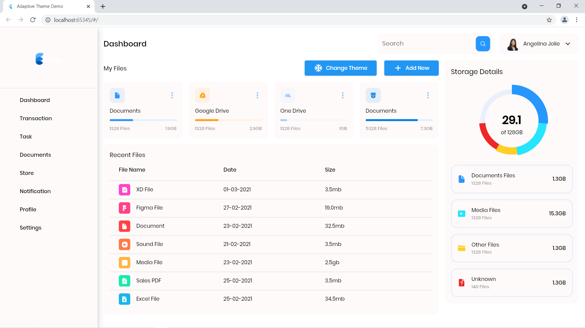
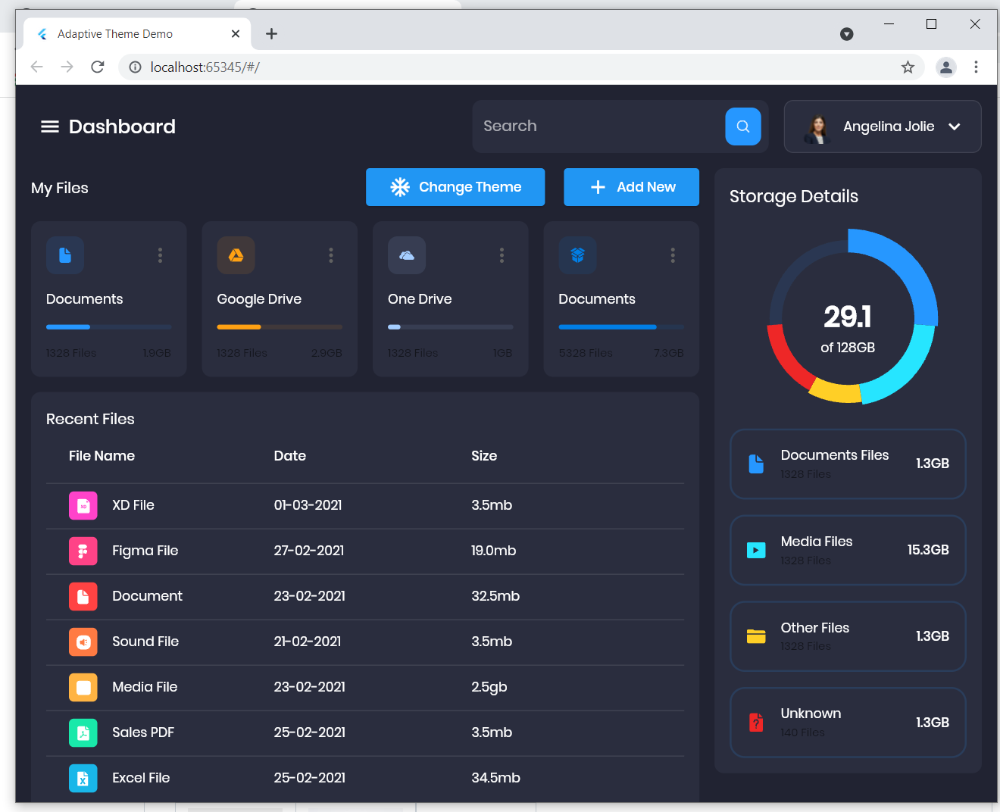
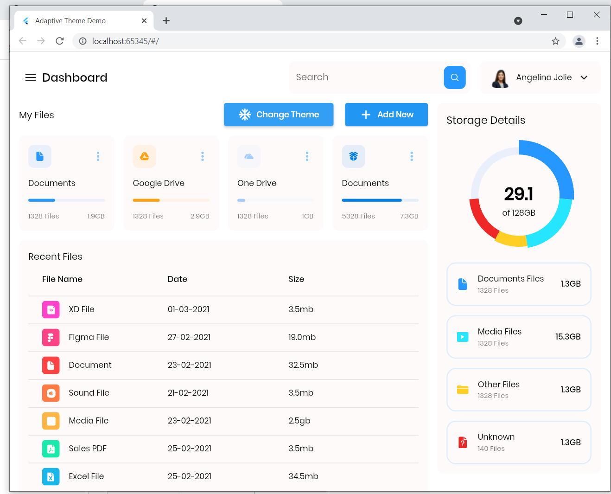
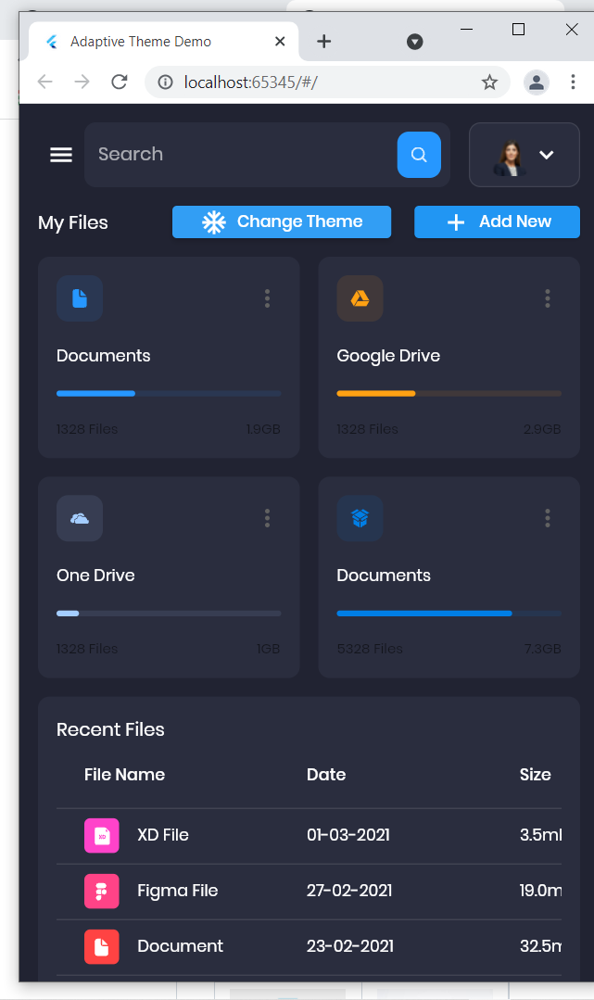
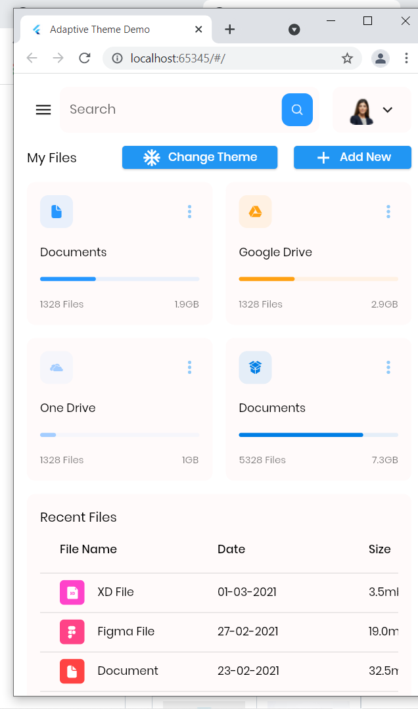

# 🔥🔥 Responsive Admin Panel or Dashboard - Flutter UI 🔥🔥 

<h1 align="center">
  Dayma Manish
</h1>

Star⭐ the repo if you like what you like more stuff on flutter 😉.

## ✨ Requirements
* Any Operating System (ie. MacOS X, Linux, Windows)
* Any IDE with Flutter SDK installed (ie. IntelliJ, Android Studio, VSCode etc)
* A little knowledge of Dart and Flutter.

## ✨ Specifications
* Responsive for all width and devices
* Light and Dark Themes.
* Contributions are most welcome.

## Some Screenshots For You 💖
 

## Website or Desktop

 

## Tablet or Ipad
|

 

## Mobile Devices
|

